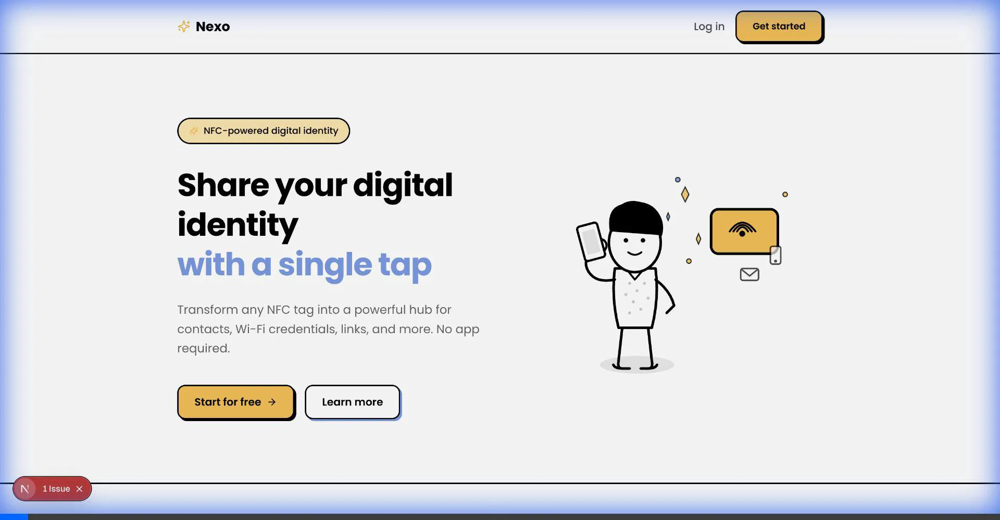
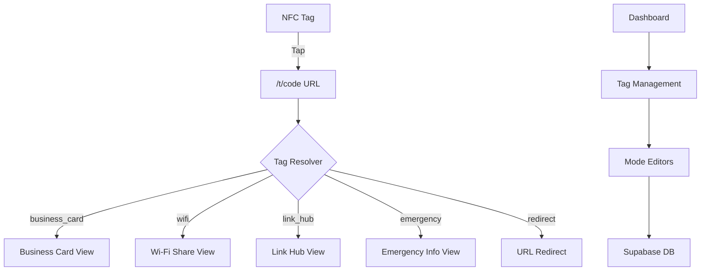
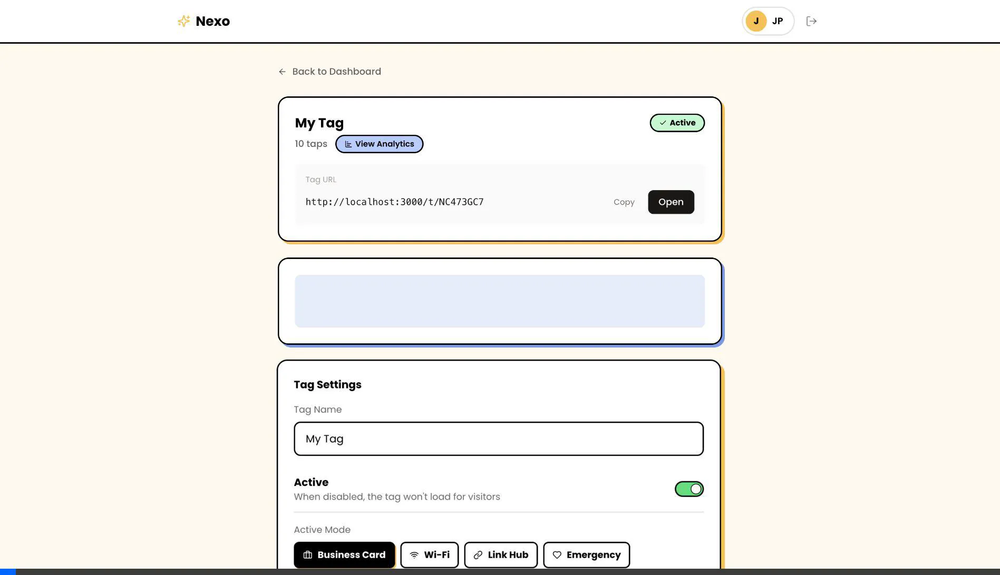
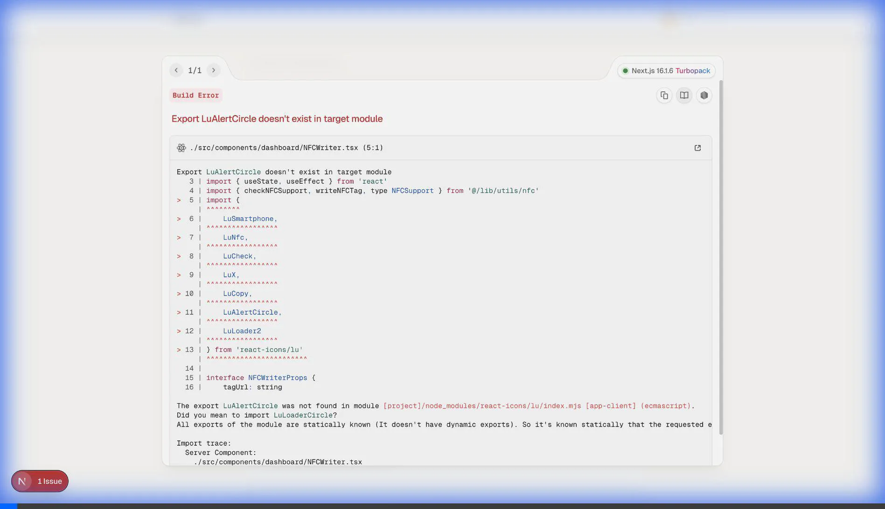
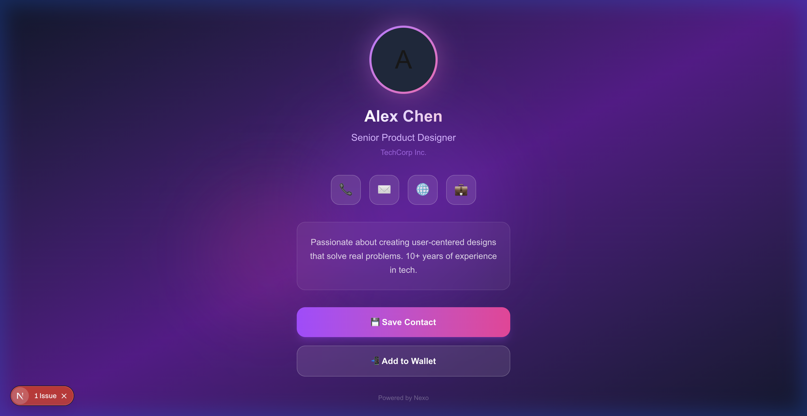
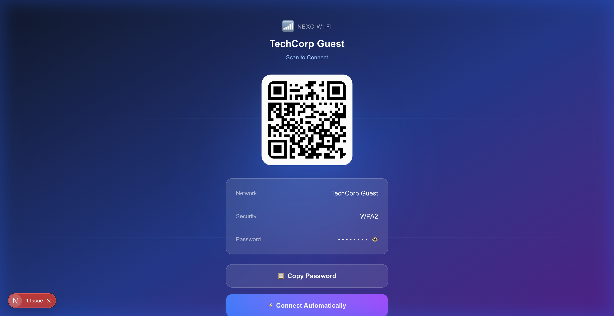
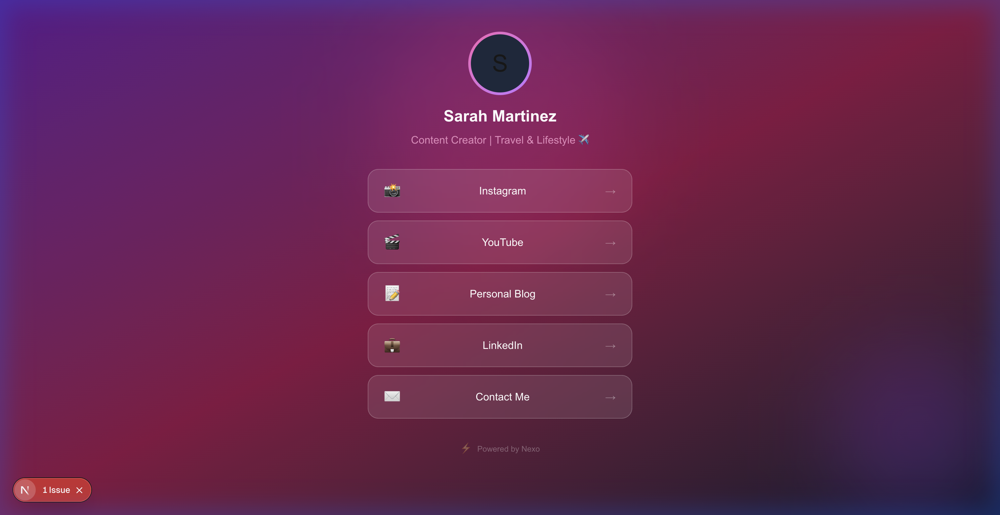
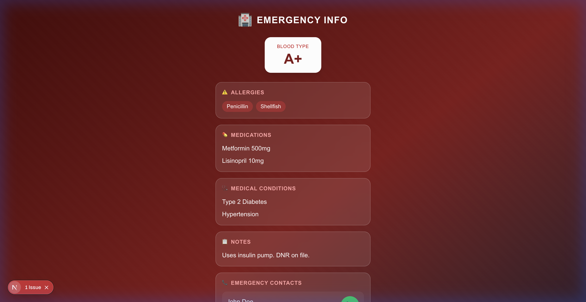

# Nexo - NFC Keychain Platform

A Next.js 14 application that transforms NFC tags into dynamic digital identity hubs. Configure your tags to display business cards, share Wi-Fi credentials, show link hubs, provide emergency info, or redirect to any URL.



## ✨ Features

- **🪪 Business Card** - Digital contact card with vCard download
- **📶 Wi-Fi Share** - Share network credentials via QR code
- **🔗 Link Hub** - Linktree-style collection of links
- **🏥 Emergency Info** - Medical information for first responders
- **↗️ Redirect** - Simple URL redirect
- **📱 Progressive Web App (PWA)** - Installable on iOS/Android for offline use
- **🎨 Custom Styles** - Hand-drawn "sketchy" UI aesthetic
- **📱 QR Code Fallback** - Native QR generation for non-NFC devices

## 🏗️ Architecture



## 🚀 Quick Start

### Prerequisites
- Node.js 18+
- Supabase account

### Installation

```bash
# Clone the repository
git clone https://github.com/yourusername/nexo-app.git
cd nexo-app

# Install dependencies
npm install

# Set up environment variables
cp .env.example .env.local
# Edit .env.local with your Supabase credentials

# Run development server
npm run dev
```

Open [http://localhost:3000](http://localhost:3000)

### Supabase Setup

1. Create a new Supabase project
2. Go to SQL Editor and run the migration in `supabase/migrations`
3. Get your credentials from Project Settings → API
4. Add to `.env.local`:
   ```
   NEXT_PUBLIC_SUPABASE_URL=your-project-url
   NEXT_PUBLIC_SUPABASE_ANON_KEY=your-anon-key
   ```

See [SUPABASE_SETUP.md](SUPABASE_SETUP.md) for detailed instructions.

## 📱 Screenshots

### Dashboard
Clean, minimal dashboard for managing your tags:


### Tag Editor
Configure your tag settings and mode content:



### NFC Tag Writing
Program physical NFC tags directly from the browser (Android Chrome):



### Public Tag Views

| Business Card | Wi-Fi Share | Link Hub | Emergency Info |
|---------------|-------------|----------|----------------|
|  |  |  |  |

## 🧪 Testing

The project maintains high code coverage (~87%) with a comprehensive testing strategy:

- **Unit Tests**: Powered by **Vitest** for all utility functions and UI components.
- **Integration Tests**: **React Testing Library** verifies critical flows (Auth, Dashboard, Public Views).
- **E2E Tests**: **Playwright** ensures end-to-end reliability for key user journeys.
- **CI/CD**: Tests run automatically on Vercel deployment hooks (`npm run build` triggers `npm run test:ci`).

To run tests locally:
```bash
# Run unit & integration tests
npm test

# Run tests with coverage report
npm run test:coverage

# Run E2E tests (requires dev server running)
npm run test:e2e
```

## 🔒 Security

- **Row Level Security (RLS)**: Strict database access policies.
- **Server-side Auth**: Secure cookie-based sessions via Supabase.
- **Middleware Protection**: Route guards for dashboard access.
- **Input Validation**: Robust form handling and file upload checks.
- **Env Var Protection**: CI/CD pipeline ensures tests run without exposing real secrets.

## 📄 License

MIT License - see [LICENSE](LICENSE) for details.

---

Built with ❤️ using Next.js and Supabase
