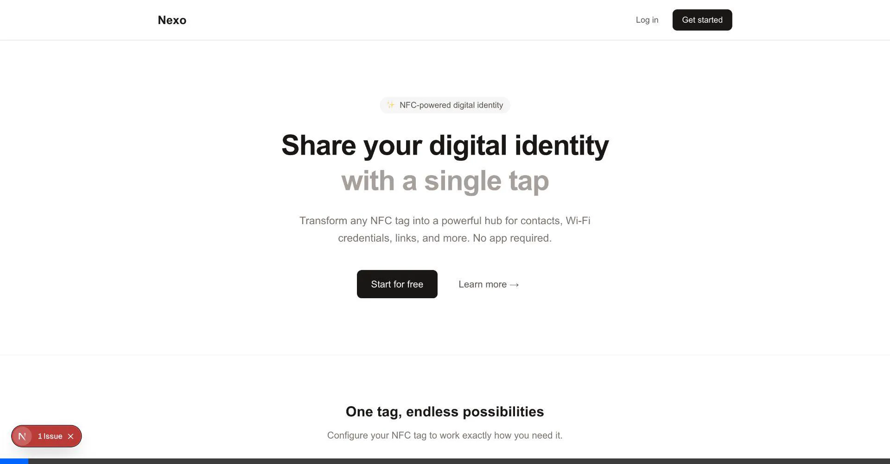
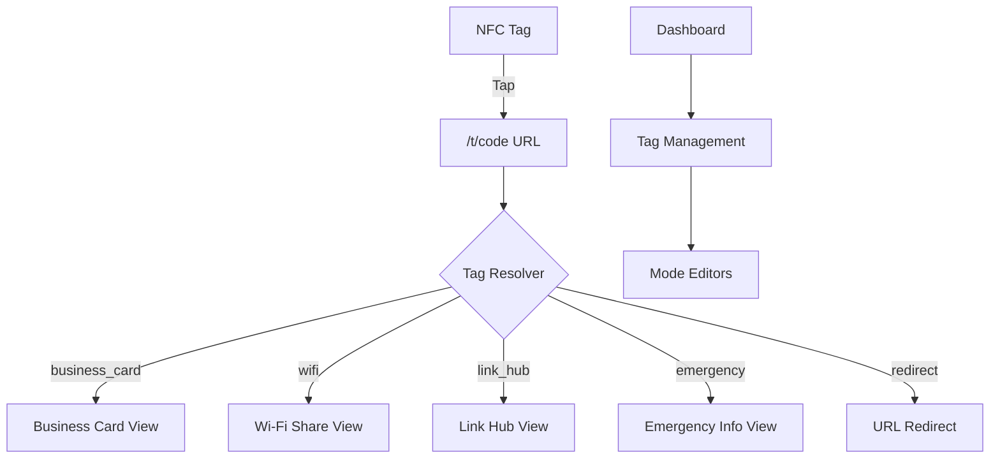
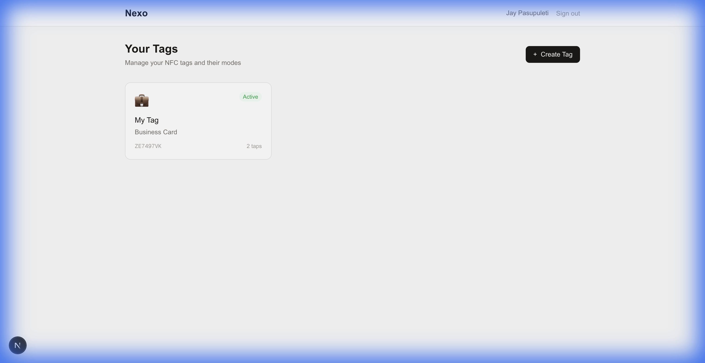
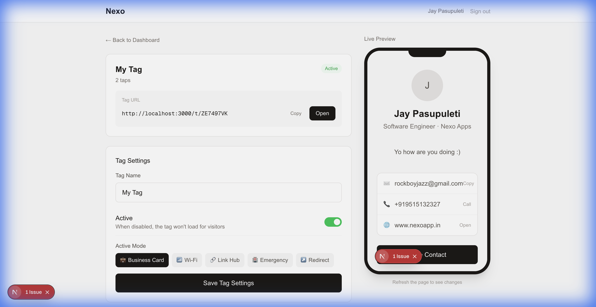
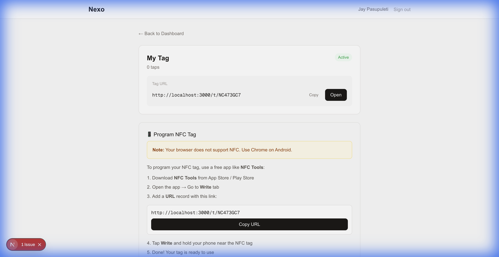

# Nexo - NFC Keychain Platform

A Next.js 14 application that transforms NFC tags into dynamic digital identity hubs. Configure your tags to display business cards, share Wi-Fi credentials, show link hubs, provide emergency info, or redirect to any URL.



## ✨ Features

- **🪪 Business Card** - Digital contact card with vCard download
- **📶 Wi-Fi Share** - Share network credentials via QR code
- **🔗 Link Hub** - Linktree-style collection of links
- **🏥 Emergency Info** - Medical information for first responders
- **↗️ Redirect** - Simple URL redirect

## 🏗️ Architecture



## 🚀 Quick Start

### Prerequisites
- Node.js 18+
- Supabase account

### Installation

```bash
# Clone the repository
git clone https://github.com/yourusername/nexo-app.git
cd nexo-app

# Install dependencies
npm install

# Set up environment variables
cp .env.example .env.local
# Edit .env.local with your Supabase credentials

# Run development server
npm run dev
```

Open [http://localhost:3000](http://localhost:3000)

### Supabase Setup

1. Create a new Supabase project
2. Go to SQL Editor and run the migration in `supabase/migrations/001_initial_schema.sql`
3. Get your credentials from Project Settings → API
4. Add to `.env.local`:
   ```
   NEXT_PUBLIC_SUPABASE_URL=your-project-url
   NEXT_PUBLIC_SUPABASE_ANON_KEY=your-anon-key
   ```

See [SUPABASE_SETUP.md](SUPABASE_SETUP.md) for detailed instructions.

## 📱 Screenshots

### Dashboard
Clean, minimal dashboard for managing your tags:



### Tag Editor
Configure your tag settings and mode content:



### NFC Tag Writing
Program physical NFC tags directly from the browser (Android Chrome) or get step-by-step instructions for iOS:



### Public Tag Views

| Business Card | Wi-Fi Share | Link Hub | Emergency Info |
|---------------|-------------|----------|----------------|
| Digital contact with vCard | QR code for easy connection | Collection of links | Medical info for emergencies |

## 📁 Project Structure

```
nexo-app/
├── src/
│   ├── app/
│   │   ├── (auth)/          # Login/Signup pages
│   │   ├── (dashboard)/     # Protected dashboard routes
│   │   └── t/[code]/        # Public tag resolver
│   ├── components/
│   │   ├── dashboard/       # Tag management UI
│   │   │   └── editors/     # Mode-specific editors
│   │   └── modes/           # Public mode display components
│   └── lib/
│       ├── supabase/        # Supabase client configuration
│       ├── types/           # TypeScript type definitions
│       └── utils/           # Helper functions
└── supabase/
    └── migrations/          # Database schema
```

## 🛠️ Tech Stack

- **Framework**: Next.js 14 (App Router)
- **Database**: Supabase (PostgreSQL)
- **Auth**: Supabase Auth
- **Styling**: Tailwind CSS
- **Language**: TypeScript

## 📲 Programming NFC Tags

### Option 1: Web NFC (Android Chrome)
1. Open your tag editor on Android Chrome
2. Click "Write to NFC Tag"
3. Hold your blank NFC tag near the phone
4. Done!

### Option 2: NFC Tools App (iOS/Desktop)
1. Download **NFC Tools** from App Store / Play Store
2. Go to **Write** tab
3. Add a **URL** record with your tag's URL
4. Tap **Write** and hold your phone near the NFC tag

## 🔒 Security

- Row Level Security (RLS) on all database tables
- Server-side authentication with cookie-based sessions
- Protected dashboard routes via middleware

## 📄 License

MIT License - see [LICENSE](LICENSE) for details.

## 🤝 Contributing

Contributions are welcome! Please open an issue or submit a pull request.

---

Built with ❤️ using Next.js and Supabase
